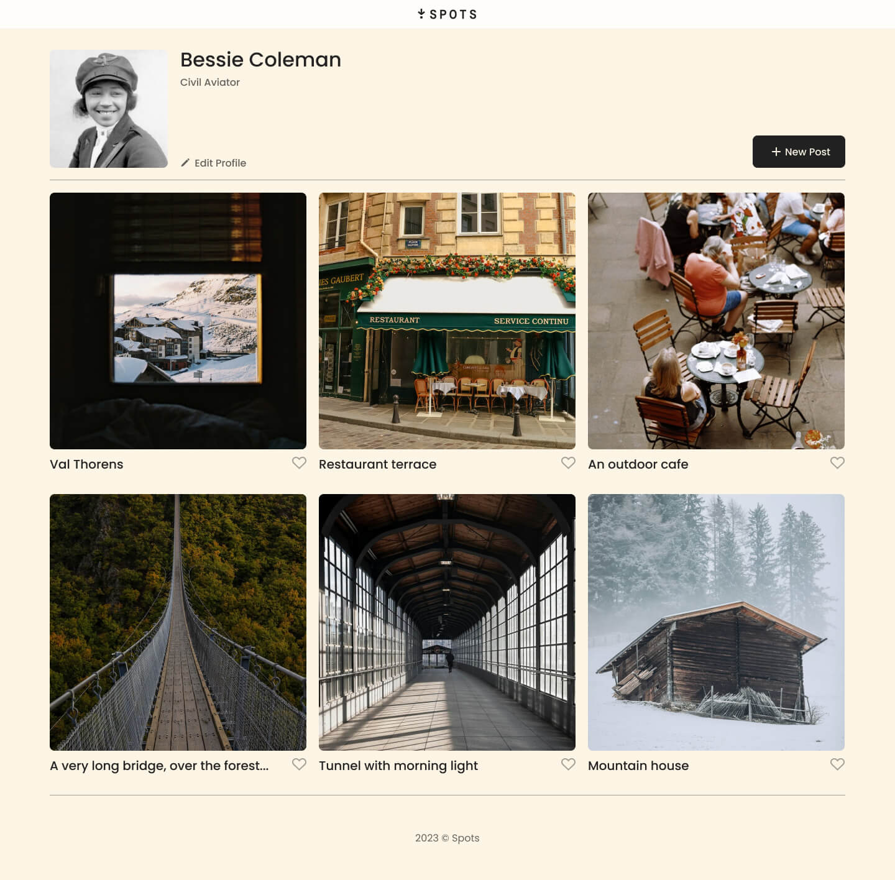
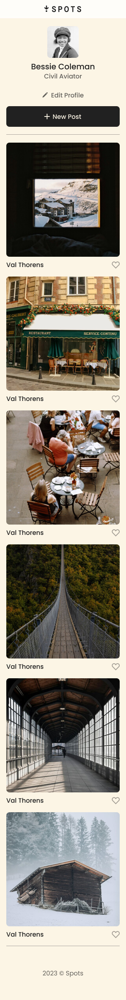

# Spots

Spots is a social media web application where users can share and explore images in a clean, responsive layout. Built using semantic HTML5 and CSS3, the platform is designed to work seamlessly across both desktop and mobile devices.

## Tech Stack

- HTML5
- CSS3
- Git Bash

## Techniques and Features

- Responsive design for mobile and desktop
- Semantic HTML5 structure
- Flexbox and Grid layouts
- Flat BEM file structure

## Screenshots

### Desktop View (1440px width)

### Mobile View (320px width)

## Deployment

This webpage is deployed to GitHub Pages.

- [Spots Live on GitHub Pages](https://mreyes-swe.github.io/se_project_spots/)
